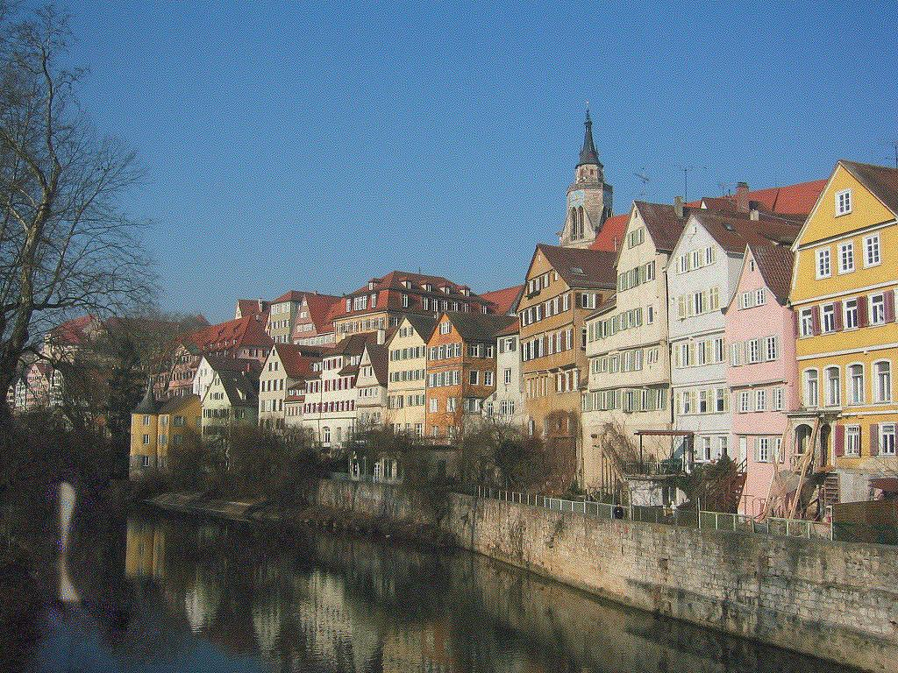
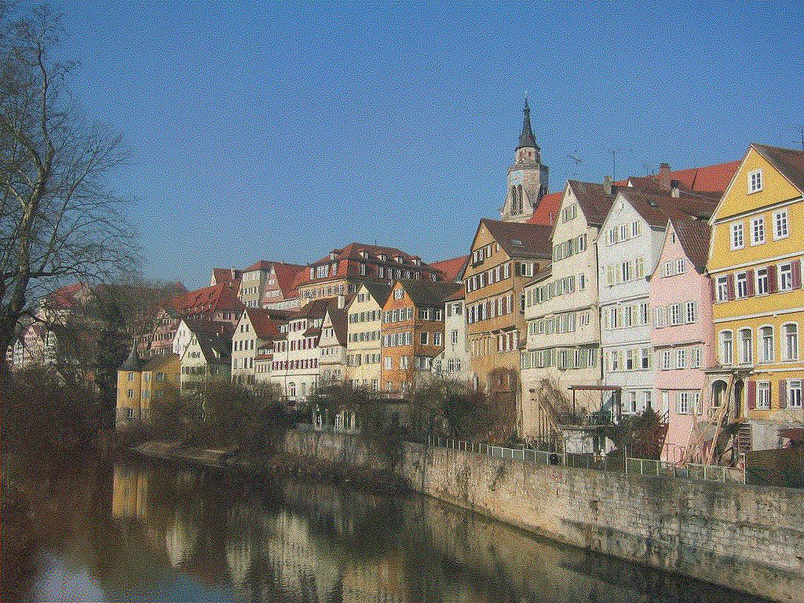
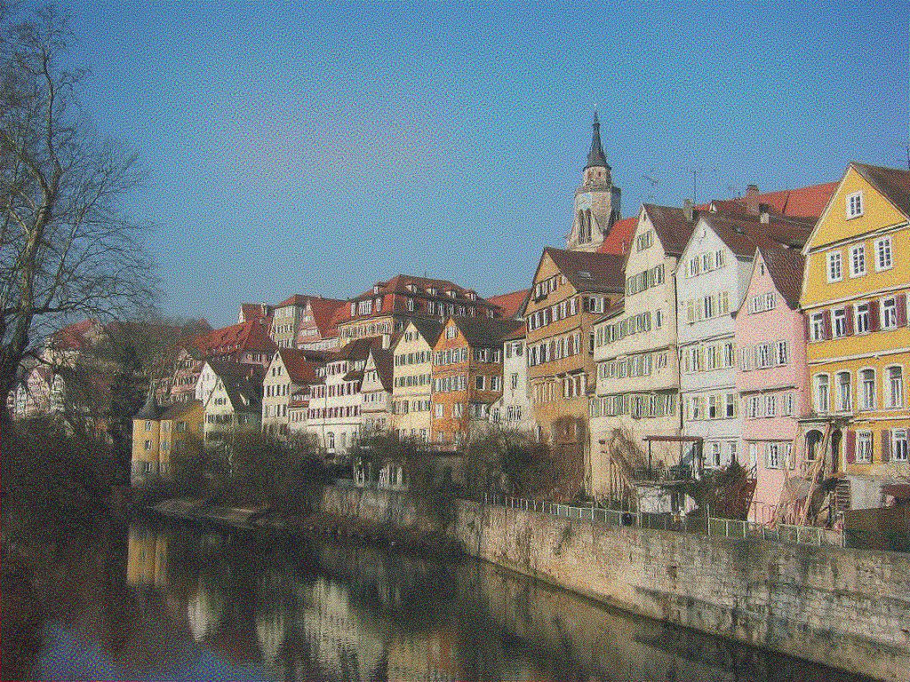
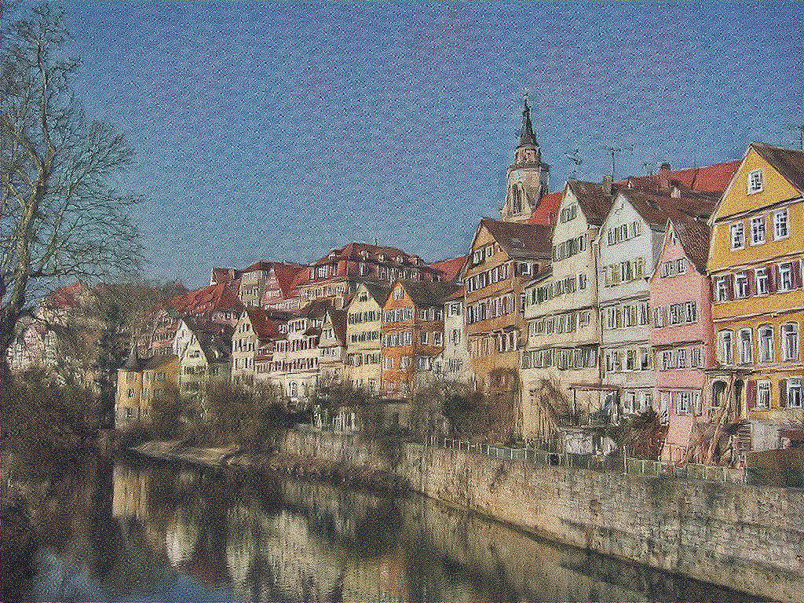
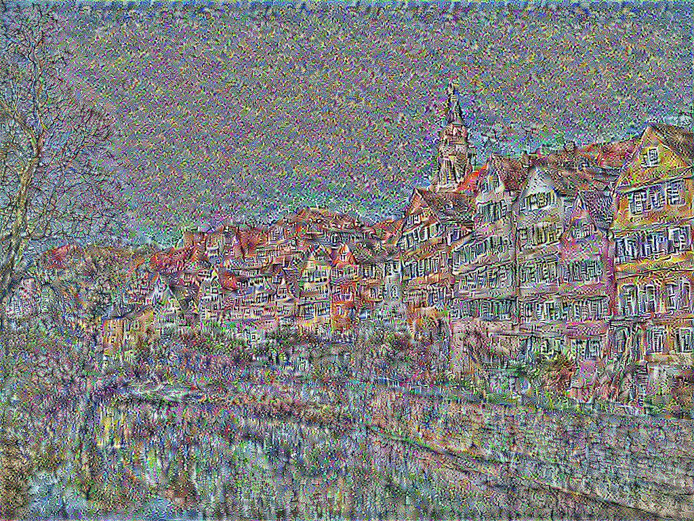
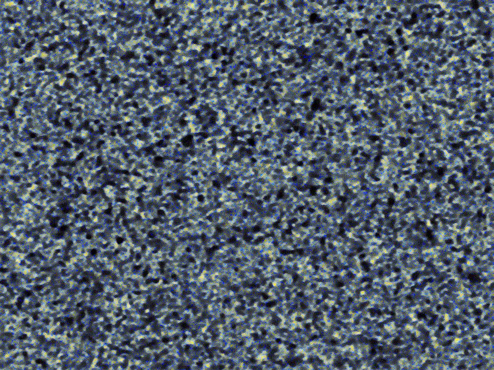
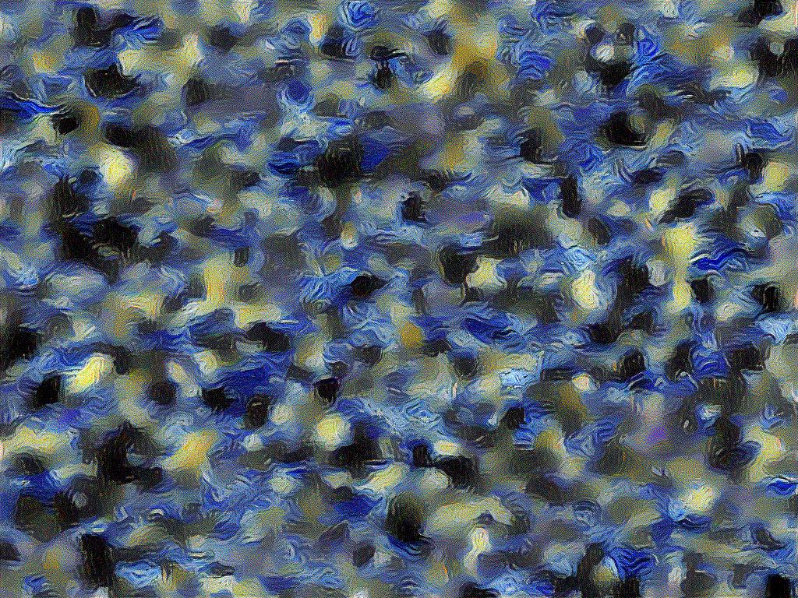
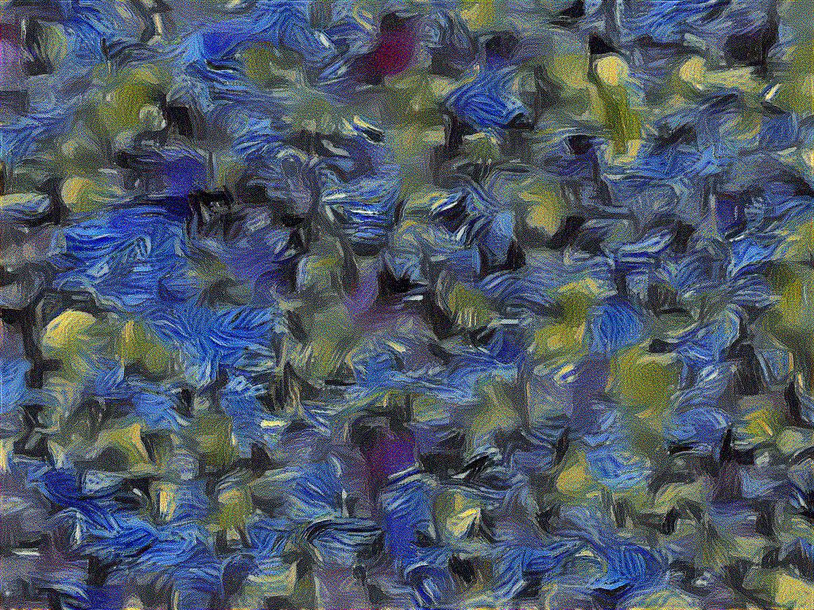
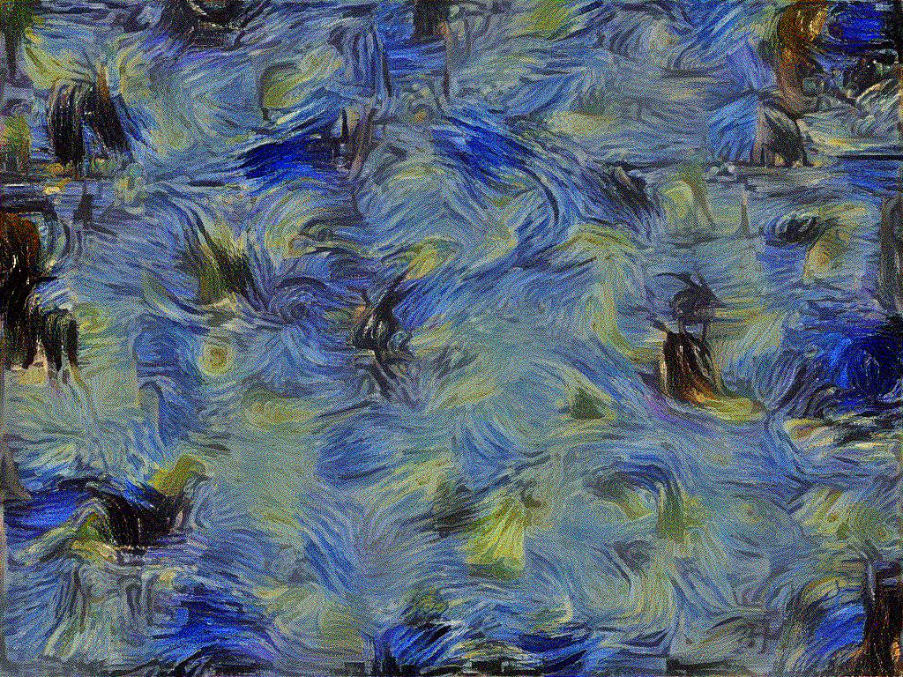
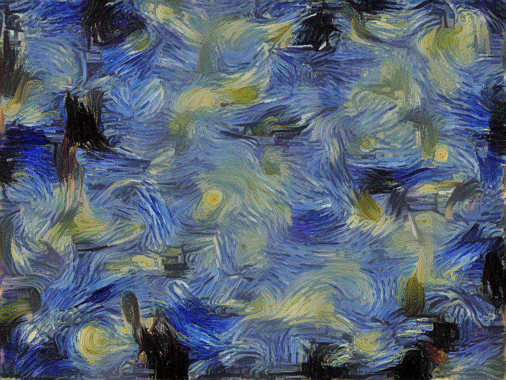

# Style Transfer using Convolutional Neural Network
###### Ryan Chan Last Updated: 3 October 2018

## Model Structure and the Flow of Information
_Given a content image and a style image, how does the style transfer model generate a synthsized model?_

First, the style image is rescaled to be the same size as the content image. Both are passed into a pre-trained VGG Network, the activations of specific layers are extracted as constants. For style image, we pre-computed the gram matrix for each style activation. Then, we initialize a tensorflow variable with a random image that has the same size as the content image. We also build the tensorflow graph that defines the strucutre for how content loss and style loss is computed. Then, the image is updated iteratively by computing the gradient of scaled content and style losss combined. 

_How are style loss and content loss computed?_

The paper defines the style loss to be $$L_{\text{style}} = $$

and content loss to be $$L_{\text{content}}$$

## Replication of Figures
### Figure 1 - Image Representations in a Convolutional Neural Network

**Content Reconstruction.**
The following figures are created with `alpha = 1, beta = 0`.

||||||
|:---:|:---:|:---:|:---:|:---:|
|`conv1_1`|`conv2_1`|`conv3_1`|`conv4_1`|`conv5_1`|

**Style Reconstruction.**
The following figures are created with `alpha = 0, beta = 1`.

||||||
|:---:|:---:|:---:|:---:|:---:|
|`conv1_1`|`conv1_1` `conv2_1`|`conv1_1` `conv2_1` `conv3_1`|`conv1_1` `conv2_1` `conv3_1` `conv4_1`|`conv1_1` `conv2_1` `conv3_1` `conv4_1` `conv5_1`|

## Future Work
**Definition of Representation.** One advantanges of using neural networks on images is that there already exist perhaps the most useful and direct way to represent an image using numbers - pixel values. But this representation is not necessarily the only way to represent visual content. If there exist a different kind of "embedding" that encodes objects or relationship between pixels in a different way, content and style representation might change the way style transfer model defines the relationship between objects, or even color. 

**CNNs to Other Types of Neural Nets.** One inspiration of Convolutional Neural Networks is the hierachical structure of simple cells and complex cells in the human visual cortex. Layer by layer, using convolution operation, an artifical neuron summaries information from previous layer and compresses into a smaller space, which is then passsed onto the later layers. This type of model is one of many ways of compressing into a more meaning and less redundant representation. Style Transfer takes advantages of this representation, but does not necessarily limit itself to other types of representations. If there exist other models, not limited to neural networks, that contain meaning representations of objects in images, content and style transfer in our style transfer model may present different results, perhaps more meaningful ones.

**Losses and differences.** The current style transfer model utilizes mean square error, which computes the difference between pixel values from the content or style image and the synthsized image. From a mathematical point of view, this seems logical and reasonable. But, a difference in pixel value may not necessarily imply a difference in content or style. For instance, if we were to create a synthsized image that is more invariant to the position of objects in our synthesized image, calculate the exact difference in pixel at each coordinate would not be sensible. In other words, the definition of loss when considering objects may require a much more extensive function than computing losses. 

## References
Gatys, Leon A., Alexander S. Ecker, and Matthias Bethge. 2016. “Image Style Transfer Using Convolutional Neural Networks.” 2016 IEEE Conference on Computer Vision and Pattern Recognition (CVPR). doi:10.1109/cvpr.2016.265.

Gatys, L., Ecker, A. and Bethge, M. (2016). A Neural Algorithm of Artistic Style. Journal of Vision, 16(12), p.326.